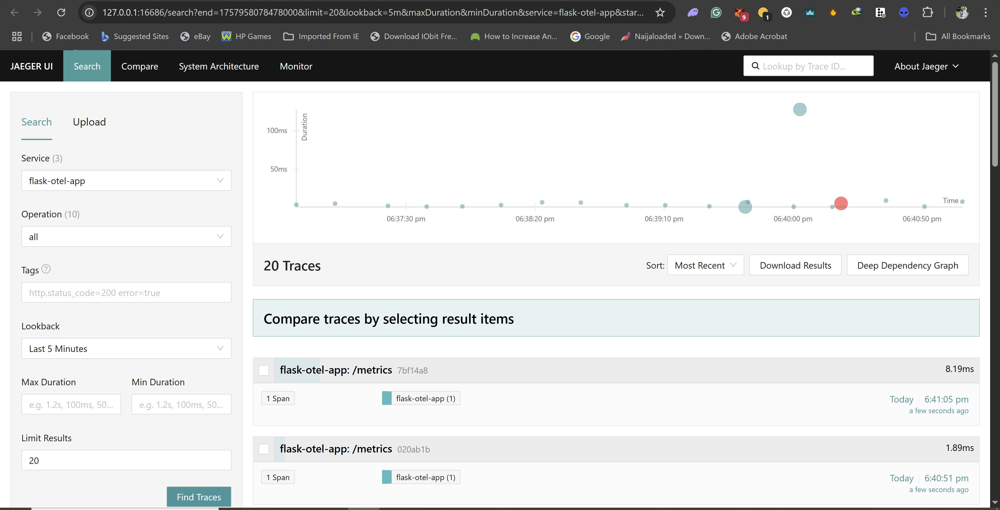
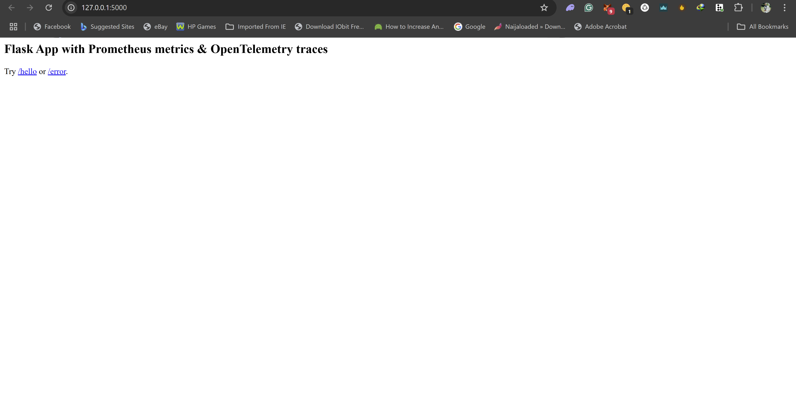
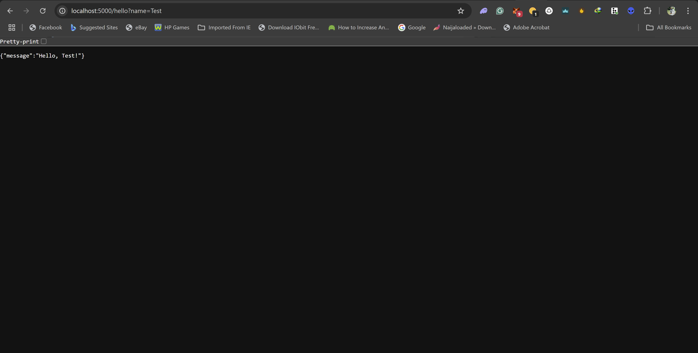
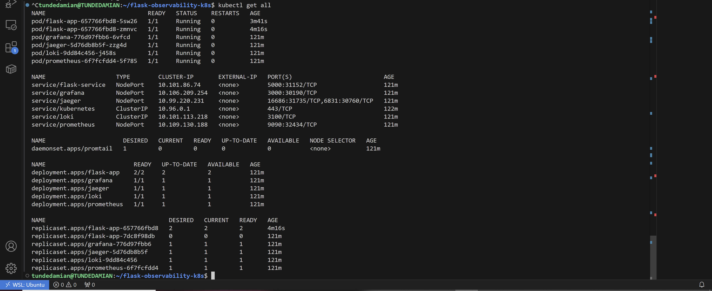
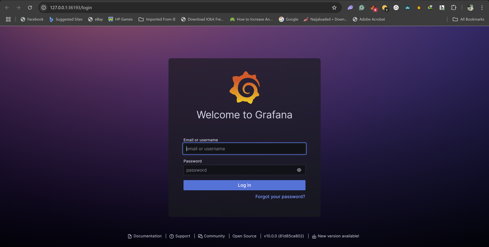
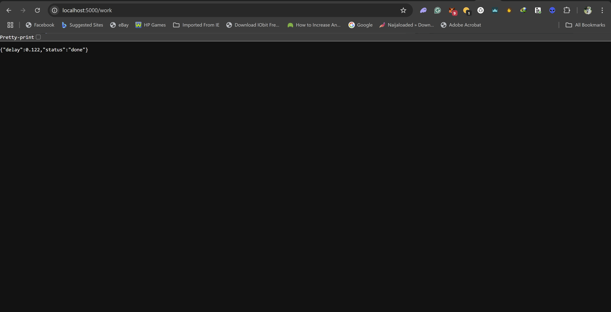
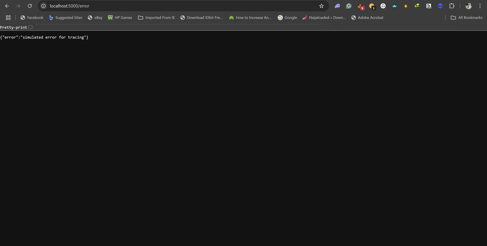

# Flask App with Observability Stack on Kubernetes

This project demonstrates a Python Flask application with a complete observability stack deployed on Kubernetes using open-source tools.

## Features

- Flask application with Prometheus metrics and OpenTelemetry tracing
- Kubernetes deployment with multiple replicas
- Full observability stack: Prometheus, Grafana, Jaeger, Loki, and Promtail
- Automated Docker image builds with GitHub Actions

## Prerequisites

- Docker
- Kubernetes (minikube, kind, or cloud provider)
- kubectl

## Deploying the Application

1. Clone this repository
2. Navigate to the project directory
3. Apply the Kubernetes manifests:
   ```
   kubectl apply -f k8s/
   ```

## Setting up GitHub Actions

For the GitHub Actions workflow to work properly, you need to set up a Docker Hub access token as a repository secret:

1. Create a Docker Hub access token at https://hub.docker.com/settings/security
2. In your GitHub repository, go to Settings > Secrets and variables > Actions
3. Create a new repository secret named `DOCKERHUB_ACCESS_TOKEN` with your Docker Hub access token as the value

## Accessing the Services

After deployment, you can access the services using port forwarding:

- Flask app: `kubectl port-forward service/flask-service 5000:5000`
- Prometheus: `kubectl port-forward service/prometheus 9090:9090`
- Grafana: `kubectl port-forward service/grafana 3000:3000`
- Jaeger: `kubectl port-forward service/jaeger 16686:16686`
- Loki: `kubectl port-forward service/loki 3100:3100`

## Monitoring and Tracing Endpoints

- Flask app metrics: http://localhost:5000/metrics
- Prometheus targets: http://localhost:9090/targets
- Jaeger UI: http://localhost:16686
- Grafana UI: http://localhost:3000 (default admin/admin)

## Screenshots

Here are some screenshots of the deployed services:

### Jaegar Dashboard


### Flask App with Prometheus and Otel Metrics


### Flask App test Metrics


### Application Metrics


### Kubernetes Deployment


### Loki Logs


### Overall Architecture


## Useful Commands

Check pod status:
```bash
kubectl get pods
```

View logs:
```bash
kubectl logs -l app=flask-app
```

Scale the deployment:
```bash
kubectl scale deployment flask-app --replicas=3
```

## Troubleshooting

If you encounter issues with the Flask app not sending traces to Jaeger:
1. Check that the Jaeger service is running and accessible
2. Verify the OTLP endpoint configuration in the Flask app
3. Check the Jaeger logs for any connection errors
4. Ensure network policies allow communication between services

## Contributing

Feel free to submit issues and pull requests to improve this project!

## License

This project is open source and available under the MIT License.
